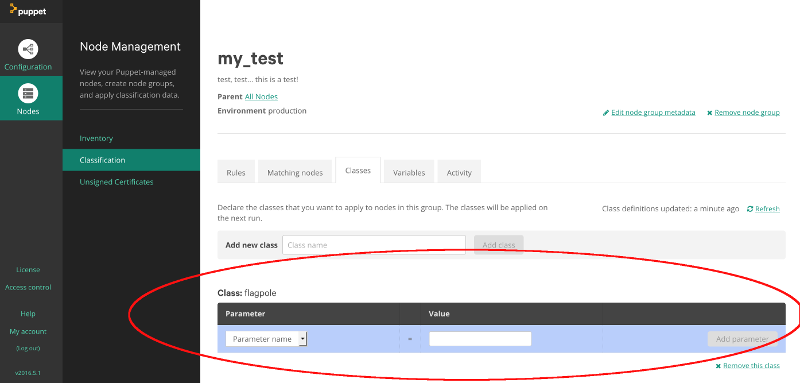
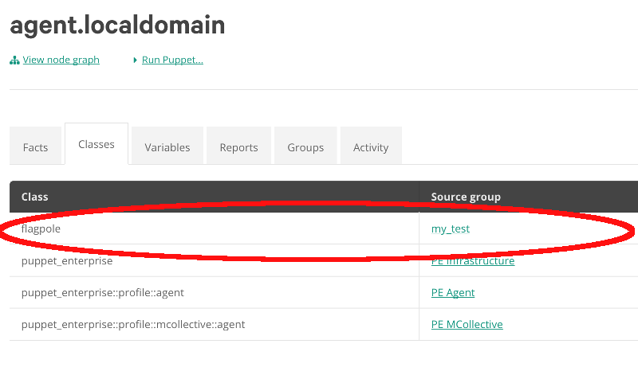
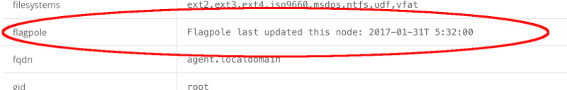

# flagpole

#### Table of Contents

1. [Description](#description)
1. [Setup - The basics of getting started with flagpole](#setup)
    * [What flagpole affects](#what-flagpole-affects)
    * [Setup requirements](#setup-requirements)
    * [Beginning with flagpole](#beginning-with-flagpole)
1. [Usage - Configuration options and additional functionality](#usage)
1. [Reference - An under-the-hood peek at what the module is doing and how](#reference)
1. [Limitations - OS compatibility, etc.](#limitations)
1. [Development - Guide for contributing to the module](#development)

## Description

This is a simple module to verify that puppet is correctly managing a resource on a given host: "Hoist it up the flagpole and see who salutes".

When the flagpole module is active on a node, it will create a file at `/tmp/flagpole` that contains the time the catalogue was generated.  This will be updated on each Puppet run.

The module ships with a custom fact `flagpole` that indicates when flagpole was last run.  If flagpole has never been run on this node (or the file it creates has been removed) the date indicated will be "never".

## Setup

### What flagpole affects

* Creates a file at `/tmp/flagpole` to indicate that the module has been active on this node at some time
* Ships a custom fact `flagpole` to give visibility to the above file

## Usage

To use `flagpole`, install the module and include the main class:

```puppet
include flagpole
```

Alternatively, you could add `flagpole` to the classes tab for a given group using the Node Classifer.


You can then see if a node will be classified to include `flagpole` on its next run by looking at a given node's `classes` tab:


Finally, after puppet has run, you can check the value of the `flagpole` fact for the node your interested in.  You should see a timestamp within 30 minutes of the current time which indicates that the class was active recently:



## Reference

### Classes
* flagpole - Install the flagpole file

### Facts
* flagpole - Interpret the flagpole file

## Limitations

* Requires write access to `/tmp/flagpole`, so only work on Unix OS's for the moment
* You must run puppet _twice_ on a given node for the console to display the correct time of update.  This is because Facts are executed at the beginning of the Puppet run when the file at `/tmp/flagpole` has not yet been created so cannot be reported.  After the initial run creating the file, the fact will be accurate.  Alternatively, you could SSH into the node in question and check for the file manually or look at the log messages in the console from a given Puppet run which will show the file being updated.

## Development

PRs Accepted :)

## Testing
This module supports testing using [PDQTest](https://github.com/GeoffWilliams/pdqtest).

Test can be executed with:

```
bundle install
bundle exec pdqtest all
```

See `.travis.yml` for a working CI example
